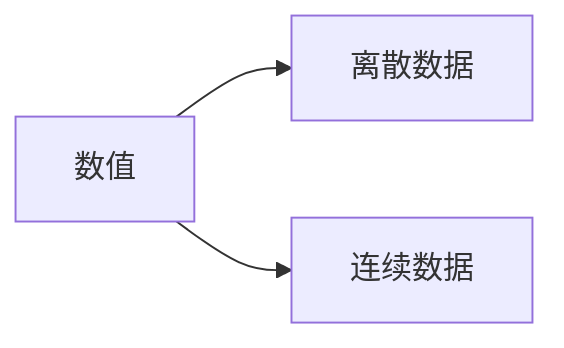

数据类型:
1. 数值
2. 分类
3. 序数

三个感兴趣的值:  
**均值** (mean),平均值  

    numpy.mean(数组)  

**中值** (median),中位值,在找到中位数之前，对数字进行排序很重要。   

    numpy.median(数组)  

**众数** (mode),常见值,出现次数最多的值     

    scipy.mode(数组) #from scipy,而非from numpy

**方差** 符号:σ^2 指示值的分散程度。如果采用方差的平方根，则会得到标准差！或反之，如果将标准偏差乘以自身，则会得到方差！

    numpy.var(数组)

**标准差** 符号:σ (PS 可以用来考虑股票的波动范围,判断高风险股票),描述值的离散程度。低标准偏差表示大多数数字接近均值,高标准偏差表示这些值分布在更宽的范围内。  
eg:
[86,87,88,86,87,85,86] 标准差是 0.9
[32,111,138,28,59,77,97] 标准差是 37.85

    numpy.std(数组)  

=====补课==========
为什么需要标准差/方差:
如何统计数据的离散程度,首先想到是的将每个数据和平均值相减,再把这些差值相加,但由于正负差值相抵消的缺陷,进一步修改为将这些差值的绝对值相加.但是,为了给于过于偏离数据更多的关注度,我们将每项差值进行平方,这就会让偏离过大的数据出来的结果也就越大.于是方差便诞生了.但是,平方的操作毕竟属于凭空产生的,为了与样本点及其均值在量纲上可比，通常会再开方得到标准差。
比如:A样本:-20,20,0,10,-10. B样本:-15,15,0,15,-15.这两个样本平均值是0,只算各项减去平均值的差值的绝对值,也是一样的60.但明显A样本的波动更大,这里要突出最大偏离数据的重要性.
=====补课 end======

**百分比数** 小于某个数值的数据数量占整个数组的百分比,即为百分比数.中位数是第50百分位数

    numpy.percentile(数组,百分比数)

当您尝试找到变量之间的关系时，会用到术语“回归”（regression）。
在机器学习和统计建模中，这种关系用于预测未来事件的结果。

**线性回归**使用数据点之间的关系在所有数据点之间画一条直线。
这条线可以用来预测未来的值。

**多项式回归**如果您的数据点显然不适合线性回归（穿过数据点之间的直线），那么多项式回归可能是理想的选择。怎么判断是否适合线性回归,即在散点图上,能看到大部分数据,呈现一种线性趋势,且每个点最后与计算出的回归线,标准差不大
    numpy.poly1d(numpy.polyfit(x, y, 3))

**多元回归**

**特征缩放**

