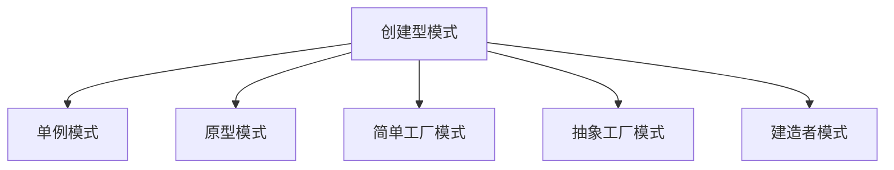
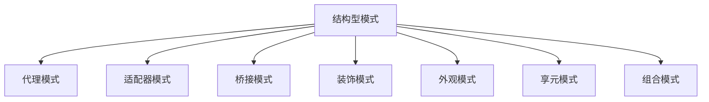
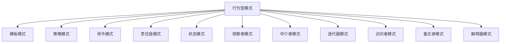

创建型模式的主要关注点是“怎样创建对象？”，使用者不需要关注对象的创建细节，对象的创建由相关的工厂来完成.
除了工厂方法模式属于类创建型模式，其他的全部属于对象创建型模式.

单例模式:
    应用场景:
        1/需要频繁创建的一些类，使用单例可以降低系统的内存压力，减少 GC。
        2/某类只要求生成一个对象的时候，如一个班中的班长、每个人的身份证号等。
        3/某些类创建实例时占用资源较多，或实例化耗时较长，且经常使用。
        4/某类需要频繁实例化，而创建的对象又频繁被销毁的时候，如多线程的线程池、网络连接池等。
        5/频繁访问数据库或文件的对象。
        6/对于一些控制硬件级别的操作，或者从系统上来讲应当是单一控制逻辑的操作，如果有多个实例，则系统会完全乱套。
        7/当对象需要被共享的场合。由于单例模式只允许创建一个对象，共享该对象可以节省内存，并加快对象访问速度。如 Web 中的配置对象、数据库的连接池等。
    特点:只有一个实例对象；该单例对象必须由单例类自行创建；单例类对外提供一个访问该单例的全局访问点。
    优点:可以保证内存里只有一个实例，减少了内存的开销;避免对资源的多重占用;可以优化和共享资源的访问。
    缺点:一般没有接口，扩展困难。如果要扩展，则除了修改原来的代码，没有第二种途径，违背开闭原则;在并发测试中，单例模式不利于代码调试。在调试过程中，如果单例中的代码没有执行完，也不能模拟生成一个新的对象;单例模式的功能代码通常写在一个类中，如果功能设计不合理，则很容易违背单一职责原则。
    实现:
        

